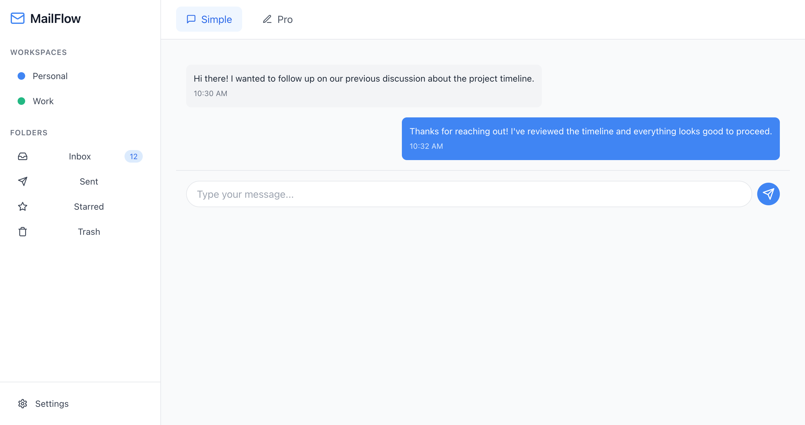

# MailFlow in Progress

### I've Created a Modern, iOS-Inspired Email Client with the Following Features:

#### Dual Mode Interface

- **Simple Mode**: Chat-like interface for quick, conversational-style messaging.
- **Pro Mode**: Includes a rich text editor (TipTap) for advanced formatting.

#### Workspace Management

- **Color-Coded Workspaces**: Organize workspaces with distinct colors for easy identification.
- **Easy Workspace Switching**: Quickly move between different workspaces as needed.
- **Multi-Account Support**: Manage multiple email accounts seamlessly.

#### Modern Design

- **iOS-Inspired Interface**: Clean, minimalistic design, reflecting modern iOS aesthetics.
- **Smooth Transitions**: Intuitive and fluid interface transitions.
- **Responsive Layout**: Optimized for various screen sizes and devices.

#### Key Features

- **Rich Text Editor**: Access formatting tools within the editor for enhanced email composition.
- **Chat-Like Interface**: A simple mode for quick, informal communication.
- **Workspace Customization**: Adjust workspace colors for personalized organization.
- **Account Switching**: Seamlessly transition between multiple email accounts.
- **Folder Organization**: Structured folder management for better email organization.
